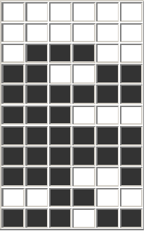
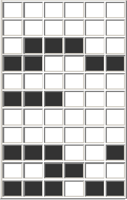
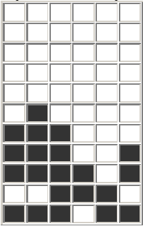

# Tumble
## Deskripsi
Runtuh adalah sebuah permainan yang bertujuan untuk membuat penuh satu baris dari sebuah papan menggunakan beberapa bangun yang disediakan. Jika sebuah baris penuh terisi maka baris tersebut akan dihilangkan dan sisa bangun di atasnya akan "diruntuhkan" satu demi satu turun melewati ruang yang telah kosong sampai menumpuk di atas bangun yang ada di bawahnya. Penumpukan yang terjadi dapat menghasilkan situasi seperti pada saat awal di atas yaitu terdapat baris-baris yang penuh terisi, yang selanjutnya akan dihilangkan lagi (setelah semua runtuh). Demikian berlangsung bisa berulang-ulang sampai tidak ada lagi baris yang penuh terisi.

Anda akan diberikan sebuah kondisi papan yang terdiri atas R (1 ≤ R ≤ 20) baris dan C (1 ≤ C ≤ 8) kolom dari suatu permainan ini untuk ditentukan kondisi akhirnya. Misalnya untuk papan seperti di bawah ini:



Kondisi papan setelah baris yang terisi penuh dihilangkan, akan menyisakan ruang kosong seperti di bawah ini:



Bangun-bangun yang terletak di atas baris terbawah yang dihilangkan akan diruntuhkan ke bawah sehingga kondisi papan setelah terjadi penurunan adalah seperti di bawah ini:



Dalam contoh di atas kebetulan keruntuhan hanya sekali saja. Namun, dalam beberapa kasus uji bisa aja terjadi keruntuhan berulang-ulang.

## Format Masukan
Baris pertama berisi dua buah bilangan bulat R dan C. R baris berikutnya masing-masing berisi C buah karakter 0 atau 1. Karakter 1 menandakan adanya bangun pada posisi tersebut.

Format Keluaran
R buah baris, masing-masing berisi C buah karakter yaitu kondisi akhir dari papan permainan tersebut.

## Contoh Masukan
```
11 6
000000
000000
011100
110011
111111
111000
111111
111111
111001
001100
111011
```
## Contoh Keluaran
```
000000
000000
000000
000000
000000
010000
111000
111001
111101
001110
111011
```