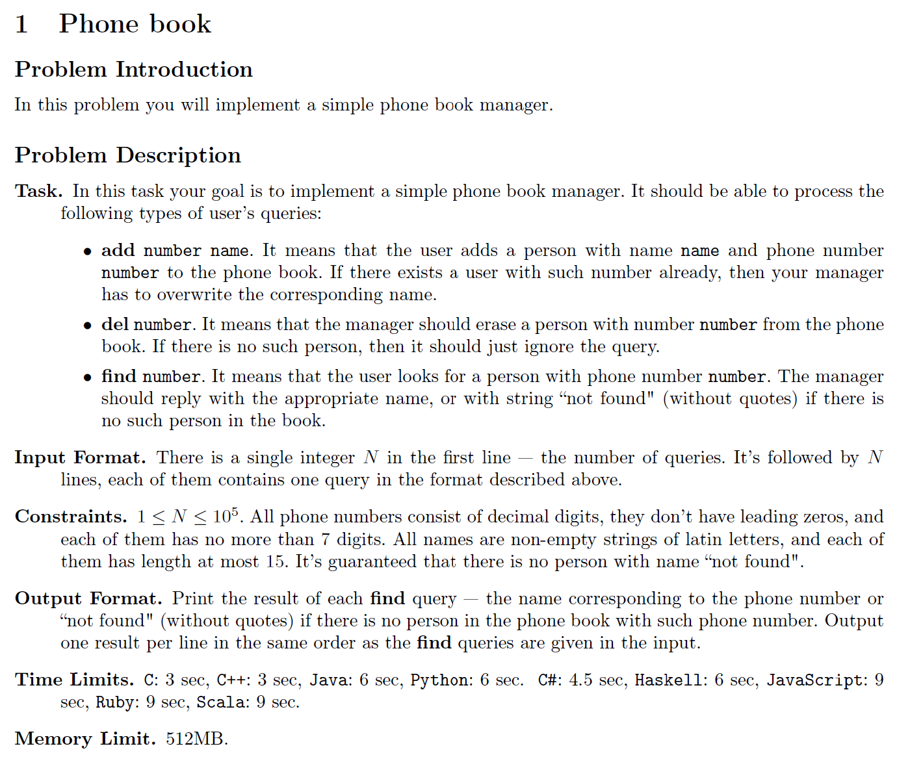
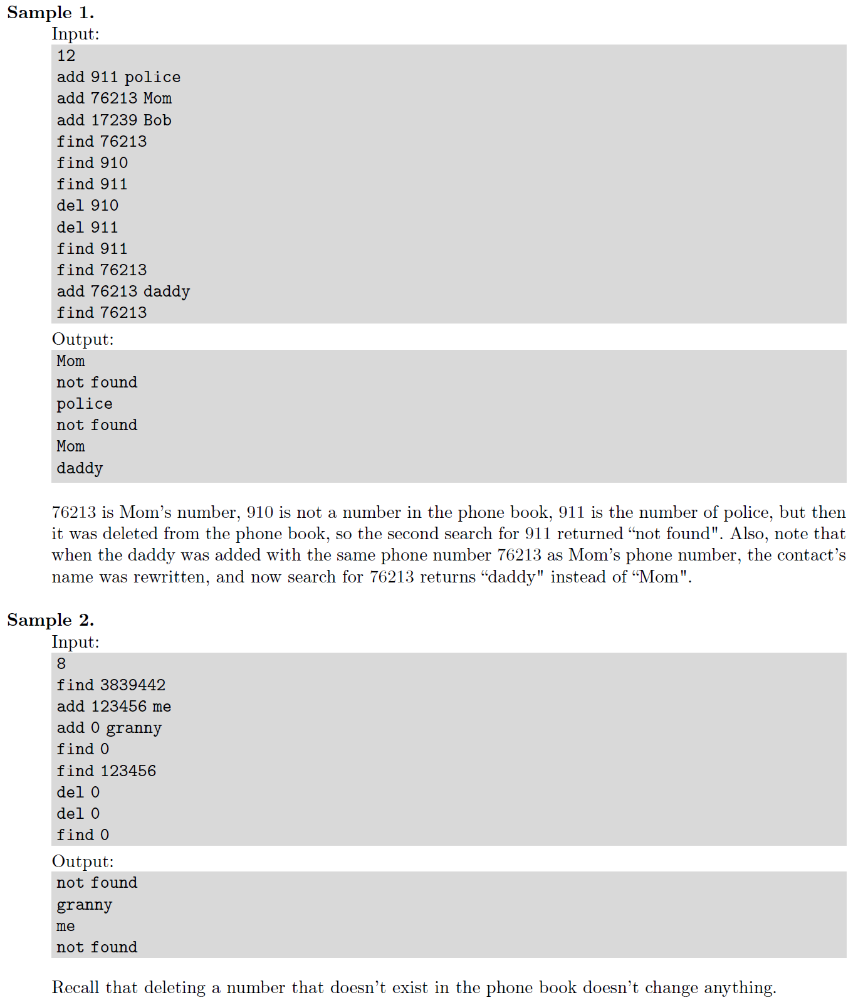

# TOPIC 01: What is Competitive Programming?
Welcome to the exciting world of competitive programming! It's a "mind sport" where you solve complex problems by designing and implementing efficient algorithms. Think of it as a blend of logic puzzles and high-speed coding, where participants from all over the world compete to solve a set of problems in the shortest amount of time.

This guide will walk you through the fundamentals, from the structure of famous competitions to the day-to-day process of becoming a successful competitive programmer.

## 1. Formats of Major Competitions
Competitive programming contests come in various flavors. While the core task is always problem-solving, the rules, duration, and style can differ significantly. Here are some of the most well-known formats:

### 🏆 ICPC (International Collegiate Programming Contest)
The ICPC is the oldest, largest, and most prestigious university-level programming competition in the world.

**Format:** Team-based.

**Team Size:** 3 students.

**Constraint:** Only one computer is shared among the three team members.

**Duration:** Typically 5 hours.

**Problems:** A set of 8 to 15 algorithmic problems.

**Goal:** Solve as many problems as possible.

**Ranking:** Teams are ranked first by the number of problems solved. Ties are broken by the total time taken. A 20-minute penalty is added for each incorrect submission on a problem that is eventually solved.

### 🏅 IOI (International Olympiad in Informatics)
The IOI is the most prestigious individual programming competition for secondary school students.

**Format:** Individual competition.

**Participants:** Each country sends a team of up to four students.

**Duration:** Two competition days. Each day consists of a 5-hour contest.

**Problems:** Typically 3 problems per day (6 total). Problems are often very complex and may have subtasks that award partial scores.

**Goal:** Maximize your score on all problems.

**Ranking:** Medals (Gold, Silver, Bronze) are awarded based on individual scores (?).

## 2. The Problem-Solving Lifecycle
Every competitive programmer follows a mental checklist when tackling a problem. Mastering this cycle is key to performing well under pressure.

### 1. Read and Understand

**Read Carefully:** Read the problem statement at least twice. Misunderstanding the problem is a common source of errors.

**Analyze Constraints:** Pay close attention to the constraints on the input size (e.g., N <= 1,000,000). This is a huge clue about the required time complexity of your solution. An O(N^2) algorithm will be too slow for N=1,000,000, but an O(N log N) or O(N) solution will pass.

**Check Input/Output:** Understand the exact format of the input and the required output. Even a single extra space can result in a "Wrong Answer."

**Work Through Samples:** Manually solve the provided sample cases to confirm your understanding.

### 2. Analyze and Design
**Identify the Core Problem:** Is it a graph problem? Dynamic programming? A number theory question? Categorizing the problem helps you recall relevant algorithms.

**Formulate an Algorithm:** Start with a simple, brute-force approach. Can it pass within the time limit? If not, how can you optimize it?

**Consider Edge Cases:** What happens if the input is empty, a single element, the maximum possible value, or contains duplicates? Thinking about these "corner cases" is crucial.

### 3. Code
**Choose Your Language:** C++ is the most common choice due to its speed and powerful Standard Template Library (STL). Java and Python are also popular.

**Write Clean Code:** Use meaningful variable names and a consistent style. While speed is important, unreadable code is hard to debug.

**Implement the Algorithm:** Translate your designed algorithm into code.

### 4. Test
**Use Sample Cases:** Run your code against all the sample cases from the problem statement.

**Create Your Own Tests:** Test your code against the edge cases you identified earlier. Try the largest possible inputs allowed by the constraints.

### 5. Submit and Debug
**Submit:** Copy-paste your code into the online judge and submit it.

#### Analyze the Verdict:

**Accepted (AC):** Congratulations! Your solution is correct.

**Wrong Answer (WA):** Your program produced incorrect output. Check your logic and edge cases.

**Time Limit Exceeded (TLE):** Your algorithm is too slow. You need a more efficient approach.

**Runtime Error (RE):** Your program crashed. This could be due to issues like dividing by zero, accessing an array out of bounds, or memory exhaustion.

**Compilation Error (CE):** Your code failed to compile. The judge will usually show you the compiler's error message.

**Iterate:** If you don't get "Accepted," go back to the analysis or coding step to find and fix the bug.

## 3. Familiarizing Yourself with Online Judges
Online judges are the platforms where you practice and compete. They automate the process of evaluating your code.

### How They Work
1. You write a program that reads input from the standard input stream (stdin) and writes the output to the standard output stream (stdout).
2. You submit your source code (e.g., a .cpp or .java file) to the platform.
3. The judge's server compiles your code.
4. It then runs your compiled program against a set of pre-defined, secret test cases.
5. It compares your program's output for each test case against the correct output.
6. It gives you a verdict based on the results.

Practicing on these platforms is the best way to improve. Good luck!