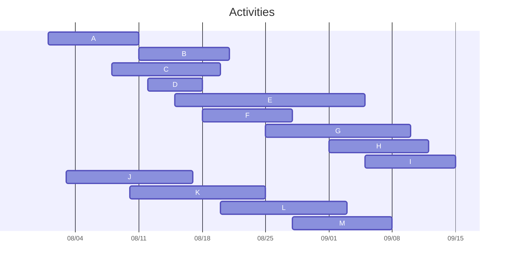

# Greedy Algorithm
A **Greedy algorithm** is a problem-solving technique, not one specific algorithm. It builds a solution step-by-step by always making the choice that seems best at the moment. You're making a locally optimal, or "greedy," choice in the hope that it will lead to a globally optimal solution.

Greedy solutions are often very **fast** and **simple to implement**, but proving that they are correct can sometimes be difficult.

## Sub-problem

The first step in solving a problem with a greedy technique is to ensure that the problem can be divided into smaller subproblems. So, how do we find the subproblem within the Activity Selection problem?

Let's establish the setup:
1.  You are given a list of activities, numbered 1 to $N$.
2.  We assume this list is sorted according to each activity's start time ($a_i.start$).

Now, imagine we make a decision. Let's assume the first activity we choose to attend is **activity $x$**.

Once we select activity $x$, a constraint is created: any other activity we attend cannot overlap with it. This means the next activity must have a start time that is greater than or equal to the end time of activity $x$ ($a_x.end$).

This is how we define the subproblem:
* Given that the activities are sorted by start time, we must find the first activity in the list, let's call it **activity $j$**, that satisfies the condition $a_j.start \ge a_x.end$.
* The new, smaller subproblem is to find the maximum number of compatible activities from the remaining set of activities, which includes everything from activity $j$ to activity $N$.

In short, after choosing an initial activity, the problem becomes solving the same "Activity Selection" problem on a reduced set of candidates. This property, where an optimal solution can be built from optimal solutions to subproblems, is called **optimal substructure**.

## Greedy Choice

Just because a problem can be broken down into subproblems does not automatically mean it can be solved with a greedy technique. For a greedy approach to work, it must have the **Greedy Choice Property**.

This means that for any subproblem you face, there must be a specific choice you can make that is guaranteed to lead to an optimal solution. This single best move at any step is called the **greedy choice**.

The Activity Selection problem is a perfect example to explore this. There are several possible greedy strategies we could try, but not all of them are optimal. Let's analyze them.

### Candidate 1: Choose the Activity with the Earliest Start Time

At first glance, this seems like a good idea. However, this strategy can fail.

* **The Flaw:** An activity might start very early but also have a very long duration. By choosing this single long activity, you might prevent yourself from attending several other shorter, non-overlapping activities that could have taken place during that same time. In other words, this choice is not always optimal.

### Candidate 2: Choose the Activity with the Shortest Duration

This also seems efficient, but similar to the first strategy, it does not guarantee an optimal solution.

* **The Flaw:** A very short activity might be scheduled in a way that it conflicts with two other activities, one before and one after. By choosing that single short activity, you might disqualify yourself from attending two other activities that you otherwise could have.

### Candidate 3: Choose the Activity with the Earliest Finish Time

This turns out to be the correct and optimal **greedy choice**.

* **The Logic:** By choosing the activity that finishes as early as possible, you maximize the amount of time remaining for all subsequent activities. Regardless of when an activity starts or how long it lasts, picking the one that frees up your schedule the soonest is always the most advantageous move. It leaves the most opportunity open, which is guaranteed to lead to an optimal solution.

## How to Spot a Greedy Problem 

A problem might be solvable with a greedy approach if it has these two properties:

1.  **Greedy Choice Property:** At every step, you can make a choice that seems best right now (the *greedy choice*), and that choice will lead to an optimal solution for the remaining subproblem.
2.  **Optimal Substructure:** The overall optimal solution can be found by combining a greedy choice with the optimal solution to the resulting smaller subproblem.

Mastering this technique requires a lot of practice. A great place to start is with a classic problem: **Activity Selection**.

## Classic Must-Know Greedy Problems 

* **Activity Selection:** Given a set of activities with start and end times, find the maximum number of activities that don't overlap.
    * **Greedy Choice:** Sort the activities by their **finish time**. Always pick the next activity that starts after the last chosen activity has finished.

* **Fractional Knapsack:** You have items with values and weights and a knapsack with a capacity limit. You can take fractions of items to maximize the total value.
    * **Greedy Choice:** Calculate the value-to-weight ratio for each item. Fill the knapsack with the items that have the **highest ratio first**.

* **Huffman Coding:** Find the most efficient binary code for a set of characters based on their frequency of appearance.
    * **Greedy Choice:** Build a tree from the bottom up by repeatedly merging the two nodes with the **lowest frequencies**.

* **Minimum Spanning Tree (MST):** In a weighted graph, find a set of edges that connects all vertices with the minimum possible total weight.
    * **Kruskal's Algorithm:** Sort all edges by weight and add the **next cheapest edge** that doesn't form a cycle.
    * **Prim's Algorithm:** Start at one vertex and grow the tree by adding the **cheapest edge** that connects a vertex inside the tree to one outside of it.

## Why Greedy Algorithms Can Fail 

The biggest pitfall is when a locally optimal choice prevents you from finding the globally optimal solution.

**The Classic Counterexample: The Coin Change Problem**

* **Problem:** Make change for an amount using the fewest coins possible.
* **Greedy Strategy:** Always take the largest coin denomination possible.

This works for standard coin sets like {1, 5, 10, 25}. But imagine you need to make change for **6** using the denominations **{1, 3, 4}**.

* **Greedy Solution:** Takes a **4**, then two **1s**. Total: 3 coins (4, 1, 1).
* **Optimal Solution:** Takes two **3s**. Total: 2 coins (3, 3).

Here, the greedy choice of taking '4' blocked the path to the best solution. When a greedy approach fails, the problem often requires a more robust technique like **Dynamic Programming**.

